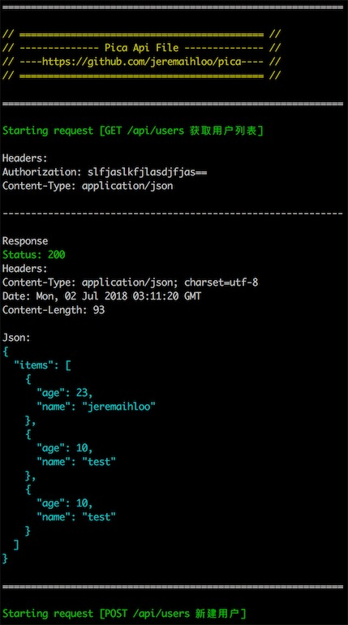
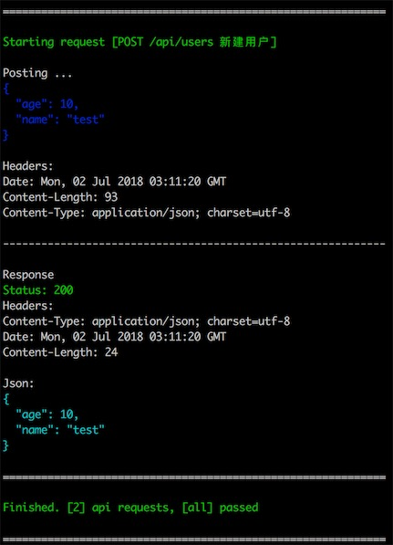

# pica

[](https://travis-ci.org/jeremaihloo/pica)
[](https://goreportcard.com/badge/github.com/jeremaihloo/pica)
[](http://www.gnu.org/licenses/gpl-3.0)
> Pica is a restful automated testing tool and document generate tool written in golang.

It's inspired deeply by [frank](https://github.com/txthinking/frank).

## Features

- Basic api test (POST, GET, PUT, DELETE, PATCH)
- Generate api document to markdown file.
- Benchmark webapi.(TODO)
- Serve api document as a website.(TODO)
    - Custom theme or css for this website(TODO).
- Api version controls, automated version release note.
- Api version diff to show.(TODO)



## Status

It's under development.

## Install

```console
go get github.com/jeremaihloo/pica/cmd/pica
```

## Usage

```
// It's a full demo for pica.

// Init vars
name = 'demo'
description = 'This is a demo for pica.'
version = '0.0.1'
author = 'jeremaihloo@gmail.com jeremaihloo'
baseUrl = 'http://localhost:8080'

headers = {
    'Content-Type' = 'application/json'
}

// Apis format: [method] [path] [description]

// GET /api/users 获取用户列表
headers['Authorization'] = 'slfjaslkfjlasdjfjas=='

// POST /api/users 新建用户
post = {
    // 用户名
    'name' = 'test'
    // 密码
    'age' = 10
}
```

```console
$ pica --help

usage: pica [<flags>] <command> [<args> ...]

A command line for api test and doc generate.

Flags:
  --help   Show context-sensitive help (also try --help-long and --help-man).
  --debug  Debug mode.

Commands:
  help [<command>...]
    Show help.

  run [<flags>] [<filename>] [<apiNames>...]
    Run api file.

  format [<flags>] [<filename>]
    Format api file.

  serve [<flags>]
    Run a document website.

  init [<filename>] [<template>]
    Init a new api file from template.

  config [<flags>]
    Config pica.


```

## TODO

- ~~Document generation~~
- Api document server
- ~~Api document version control~~

## LICENSE

The MIT License (MIT)

Copyright (c) 2018 jeremaihloo